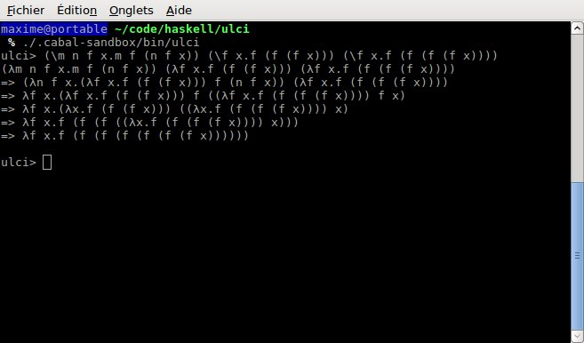

ulci is an interpreter for untyped lambda calculus, written in Haskell.

# Installation
Install the Haskell Platform. On a Debian-based system :
```console
sudo apt-get install haskell-platform
```

Then get a copy of ulci :
```console
git clone https://github.com/iemxblog/ulci
cd ulci
cabal sandbox init
cabal install --enable-tests
./.cabal-sandbox/bin/ulci
```

# Screenshot
Example : calculate 3+4 with [Church Numerals](https://en.wikipedia.org/wiki/Lambda_calculus#Arithmetic_in_lambda_calculus)


